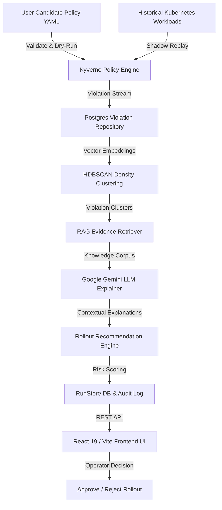

# PolicyShadow 🛡️🤖

> **Shadow Evaluation & Intelligent Decision Support System for Kubernetes Security Policies**

[](LICENSE)
[](https://python.org)
[](https://fastapi.tiangolo.com)
[](https://react.dev)
[](https://vitejs.dev)
[](https://kyverno.io)

**PolicyShadow** provides security engineers and Kubernetes cluster administrators with a non-disruptive, intelligent platform to evaluate and safely deploy admission control policies (Kyverno `ClusterPolicy`). By replaying candidate policies against historical workload records in shadow mode, PolicyShadow extracts violations, clusters them using vector embeddings and HDBSCAN, enriches them with Retrieval-Augmented Generation (RAG), and delivers AI-driven rollout recommendations with a human-in-the-loop approval workflow.

---

## 🌟 Key Features

- ⚡ **Real-Time Candidate Policy Submission & Validation**: Paste or upload custom Kyverno `ClusterPolicy` YAML files with instant syntax parsing and dry-run validation powered directly by the official Kyverno CLI.
- 🔄 **Multi-Policy Historical Replay Engine**: Replays 30+ historical Kubernetes workload manifests against custom or baseline security policies in non-enforcement (shadow) mode to measure real operational impact.
- 🧠 **Vector Embedding & HDBSCAN Clustering**: Transforms structured violation metrics and resource attributes into vector embeddings, grouping similar non-compliant workloads using HDBSCAN density clustering.
- 📚 **RAG-Augmented Explanation & Evidence Engine**: Enriches violation clusters with contextual security documentation and organizational knowledge bases, querying Google Gemini LLM for precise, evidence-backed violation explanations.
- 🎯 **Risk-Scored Rollout Recommendation Matrix**: Calculates blast radius and operational risk scores to recommend safe deployment paths (`Audit` mode vs. `Enforce` mode vs. `Exceptions required`).
- 💾 **PostgreSQL / SQLite Persistence**: Full audit history for analysis runs, violation snapshots, recommendation records, and operator decisions (`Approve` / `Reject` with audit notes).
- 🖥️ **Modern Reactive Dashboard UI**: Built with React 19, TypeScript, and Vite featuring real-time status indicators, violation drill-downs, interactive policy creation, and decision workflows.

---

## 🏗️ Architecture Workflow



---

## 📁 Repository Structure

```
CapstoneProjectDemo/
├── frontend/                        # React 19 + TypeScript + Vite Frontend Application
│   ├── src/
│   │   ├── api.ts                   # REST API client bindings & TypeScript interfaces
│   │   ├── App.tsx                  # Main App router & shell layout
│   │   ├── DashboardPage.tsx        # Aggregate metrics & summary dashboard
│   │   ├── HistoryPage.tsx          # Historical analysis run list & status tracking
│   │   ├── RunDetailView.tsx        # Cluster breakdown, violation lists & decision controls
│   │   ├── RunList.tsx              # Candidate policies overview & quick run launcher
│   │   ├── SubmitPolicyPage.tsx     # Interactive policy submission & real-time validator
│   │   ├── Sidebar.tsx              # Application navigation sidebar
│   │   └── theme.css                # Dark mode design system & tokens
│   ├── index.html
│   ├── package.json
│   └── vite.config.ts
│
├── src/policyshadow/                # Python Core Backend Package
│   ├── api/                         # FastAPI application & pipeline orchestration
│   │   ├── app.py                   # REST API endpoints & route handlers
│   │   ├── pipeline.py              # End-to-end replay, clustering & recommendation pipeline
│   │   └── analysis_runner.py       # Isolated subprocess worker executor
│   ├── clustering/                  # HDBSCAN violation clustering engine
│   │   └── clusterer.py
│   ├── core/                        # Data models, domain schemas & interfaces
│   │   ├── schemas.py
│   │   └── interfaces.py
│   ├── data/                        # Sample workloads, policies & user storage
│   │   ├── dataset.py               # Historical workload dataset loader
│   │   ├── sample_policies/         # Built-in baseline Kyverno policies
│   │   └── user_policies/           # Dynamically submitted candidate policy YAMLs
│   ├── embeddings/                  # SentenceTransformers embedding generation
│   │   └── embedder.py
│   ├── explanation/                 # LLM explainer powered by Gemini API
│   │   └── explainer.py
│   ├── persistence/                 # SQLAlchemy ORM, Neon Postgres / SQLite DB store
│   │   ├── models.py                # Database tables (runs, clusters, violations, policies)
│   │   ├── policy_store.py          # Policy persistence & file management
│   │   ├── run_store.py             # Analysis runs & decision tracking
│   │   └── postgres_repository.py   # Violation repository implementations
│   ├── policy_engines/              # Policy validation & Kyverno execution adapters
│   │   ├── kyverno_engine.py        # Kyverno CLI dry-run execution wrapper
│   │   └── policy_validator.py      # Real-time policy YAML syntax & dry-run validator
│   ├── rag/                         # Retrieval-Augmented Generation (RAG) corpus & evidence
│   │   ├── corpus/                  # Security standards & organizational knowledge base
│   │   ├── evidence_builder.py      # Evidence packager for LLM context
│   │   └── retriever.py             # Semantic retriever for security knowledge
│   ├── recommendation/              # Risk assessment & rollout decision rules engine
│   │   └── recommender.py
│   └── replay/                      # Non-enforcement shadow replay orchestrator
│       └── replay_engine.py
│
├── tests/                           # Pytest unit & integration test suite
│   ├── test_api.py
│   ├── test_policy_validator.py
│   ├── test_pipeline_isolation.py
│   ├── test_persistence.py
│   └── test_multi_policy_replay.py
│
├── LICENSE                          # MIT License
├── pyproject.toml                   # Python package configuration
└── README.md                        # Project documentation
```

---

## 🛠️ Technology Stack

| Domain | Technologies |
| :--- | :--- |
| **Backend Framework** | Python 3.11+, FastAPI, Uvicorn, Pydantic v2 |
| **Database & ORM** | PostgreSQL / Neon DB, SQLite, SQLAlchemy 2.0 |
| **Policy Engine** | Kyverno CLI v1.10+ (`ClusterPolicy` evaluation) |
| **Machine Learning** | HDBSCAN, Scikit-learn, SentenceTransformers (`all-MiniLM-L6-v2`) |
| **AI & RAG** | Google Gemini 1.5 / 2.0 Flash API, RAG Semantic Evidence Retriever |
| **Frontend Framework** | React 19, TypeScript, Vite 6, React Router DOM v7 |
| **Styling & UI** | Modern Vanilla CSS / Design Tokens, Lucide Icons, Glassmorphism UI |

---

## 🚀 Quickstart Guide

### Prerequisites
- **Python**: 3.11 or higher
- **Node.js**: v18.0 or higher
- **Kyverno CLI**: Recommended for live policy dry-runs (`kyverno` binary in system PATH)

### 1. Backend Setup

```bash
# Clone the repository
git clone https://github.com/Vandita-1011/PolicyShadow.git
cd PolicyShadow

# Create and activate virtual environment
python -m venv venv
# On Windows:
.\venv\Scripts\activate
# On Linux/macOS:
source venv/bin/activate

# Install dependencies
pip install -e .

# Configure environment variables (optional for local SQLite, required for Gemini API)
export GEMINI_API_KEY="your-gemini-api-key"
# On Windows PowerShell:
# $env:GEMINI_API_KEY="your-gemini-api-key"

# Start the FastAPI Backend Server
python -m uvicorn policyshadow.api.app:app --port 8000 --reload
```
> Backend API will be live at: **`http://127.0.0.1:8000`**

### 2. Frontend Setup

```bash
# Navigate to frontend directory
cd frontend

# Install Node dependencies
npm install

# Start Vite Development Server
npm run dev
```
> Frontend Application will be live at: **`http://localhost:5173`**

---

## 📡 REST API Reference

| Endpoint | Method | Description |
| :--- | :---: | :--- |
| `GET /` | `GET` | Health check endpoint returning `{"status": "ok"}` |
| `GET /stats` | `GET` | Aggregate stats (total runs, policies, total violations, pending decisions) |
| `GET /policies` | `GET` | List all available candidate and system policies |
| `POST /policies/validate` | `POST` | Validates candidate Kyverno policy YAML syntax and schema |
| `POST /policies/submit` | `POST` | Stores a validated custom policy and persists it to disk/DB |
| `POST /analyze` | `POST` | Triggers a full shadow replay analysis for default or specific `policy_id` |
| `GET /runs` | `GET` | Retrieve summary history of all analysis runs |
| `GET /runs/{run_id}` | `GET` | Retrieve detailed analysis run output, violation clusters, and recommendations |
| `POST /recommendations/{id}/decision` | `POST` | Record an operator decision (`approve` / `reject`) with optional rationale note |

---

## 🧪 Running Tests

Run the complete Python backend test suite using `pytest`:

```bash
# Run all tests
pytest tests/ -v
```

Validate frontend TypeScript code without emit errors:

```bash
cd frontend
npx tsc --noEmit
```

---

## 📄 License

Distributed under the **MIT License**. See [`LICENSE`](LICENSE) for details.

---

<p center>
  Developed with ❤️ for safe Kubernetes policy operations.
</p>
